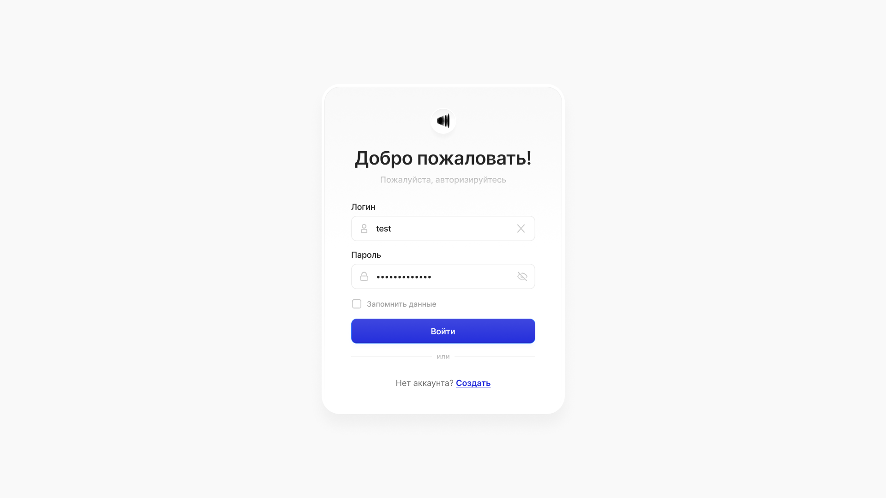
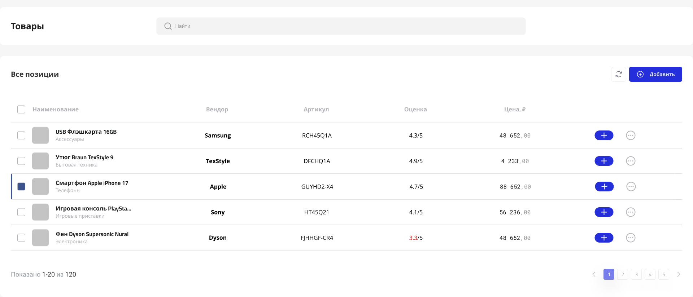

Условия:
Используй React (версия 18+).
Используй TypeScript (строгая типизация обязательна).
Работоспособность в актуальной версии Google Chrome.
Остальное (выбор стейт-менеджера, UI библиотек) на твоё усмотрение, но будь готов обосновать выбор.
Дизайн:
Реализация должна визуально соответствовать макету в Figma.
<https://www.figma.com/design/u4GSbcr9JRSsLjik5IAjRg/Aiti-Guru-%D1%82%D0%B5%D1%81%D1%82%D0%BE%D0%B2%D0%BE%D0%B5-%D0%B7%D0%B0%D0%B4%D0%B0%D0%BD%D0%B8%D0%B5--1-?node-id=1-299&t=1fgM3NjsJ9wyN8Ar-4>

Экран авторизации

Страница с товарами

API:
В качестве источника данных использовать публичное API: DummyJSON Products.
Для авторизации использовать: DummyJSON Auth

Функциональные требования:
Форма входа:
Валидация полей (обязательность заполнения).
Обработка ошибок: если API возвращает ошибку, выводить уведомление или текст ошибки под полями.
Логика запоминания данных для входа::
Если чекбокс установлен, нужно сохранять токен авторизации так, чтобы сессия жила после закрытия браузера
Если не установлен, то сессия должна сбрасываться при закрытии вкладки
Вывод списка товаров:
Соответствие столбцам из макета Figma
Прогресс-бар при подгрузке
Подгрузка данных из API.
Сортировка:
Возможность сортировки по столбцам (например, по цене или рейтингу).
Должно храниться состояние сортировки

Добавление товара:
По нажатию кнопки "Добавить" открывается форма добавления товара с возможностью заполнить основные поля: Наименование, цена, вендор, артикул.
При успешном добавлении показывать базовое Toast уведомление
Логику сохранения через API делать при этом не нужно.
Логика интерфейса:
Если рейтинг товара ниже 3, значение должно подсвечиваться красным цветом.
Поиск товаров:
Использовать API
Важно:
При использовании ИИ для выполнения задания просьба указать модель и промпты, которые использовались для генерации кода или решения проблем

Удачи! Если будут какие-то вопросы, пиши
